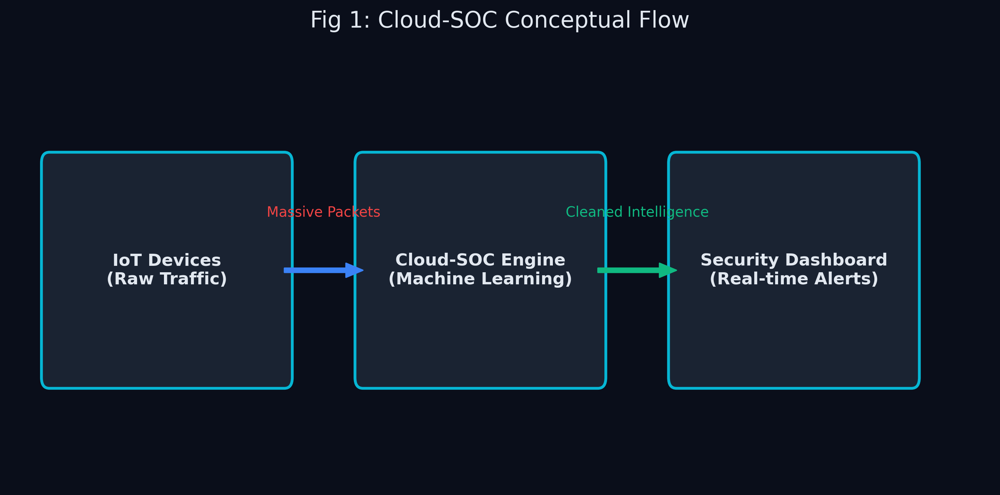

# 🌟 Cloud-SOC Dashboard: Project Overview

> **Note to the team:** Hey guys, I built this dashboard for our Cloud Machine Learning project. I know some of you are new to machine learning and cloud architectures, so I wrote this guide as simply as possible. Think of this as your "cheat sheet" to understand exactly what I built so we can crush the IEEE report together! 🚀

## 1. What is this project?
We built a **Cloud-Based IoT Security Operations Center (Cloud-SOC) Dashboard**. 

Imagine you are a security guard, but instead of monitoring cameras, you are monitoring internet traffic (data packets) coming from smart devices (IoT devices like smart fridges, smart cameras, etc.). Our dashboard uses **Machine Learning** to instantly look at that traffic and say: *"Hey, this looks like normal traffic"* (🟢 **Benign**) or *"Watch out, this is a malware attack!"* (🔴 **Malicious**).

### The "Cloud Machine Learning" Angle
Since this is for our Cloud ML course, we aren't just building a simple app. We built a system designed to simulate **a real-world hybrid cloud environment**. 
- We process huge amounts of data.
- We simulate what happens when traffic spikes (Auto-scaling).
- We show how fast our models react (Latency & Throughput).

## 2. Why did we build this? (The Problem)
IoT devices are notoriously insecure. Hackers often take them over to create "botnets" to launch massive DDoS (Distributed Denial of Service) attacks or scan networks for vulnerabilities. 

**The Challenge:** Human security analysts cannot read millions of internet packets per second. 
**Our Solution:** We trained Machine Learning models to do it for them, in real-time, and we built a beautiful dashboard to visualize it.

## 3. What does the Dashboard actually do?
Our dashboard has 5 main pages, each proving a different concept for our project:

1. **Live Threat Monitor:** Streams real-time network traffic scored by our ML model. Includes three **attack simulation buttons** (Port Scan, DDoS, C&C) that generate realistic synthetic attack traffic so you can see how the models respond to different threat scenarios.
2. **Model Performance:** Proves our Machine Learning actually works. We compare three different "brains" (Algorithms) to see which is smartest.
3. **Cloud Infrastructure:** A simulation of an AWS environment. Shows what happens when traffic gets too heavy and the cloud has to automatically add more servers (Auto-scaling).
4. **Explainable AI (XAI):** Machine learning shouldn't be a "black box". This page explains *why* the AI thought something was a hack, showing exactly which data points tipped it off.
5. **Data Pipeline:** Shows the full journey of our data, including a **Class Balancing Strategy** section with before/after SMOTE visualizations proving we handled the dataset's natural class imbalance.

## 4. The Dataset We Used
We used the famous **IoT-23 dataset**. This dataset was created by real cybersecurity researchers (Stratosphere Laboratory). They literally set up infected IoT devices in a lab, let them attack things, and recorded all the internet traffic.

*   **Total Data:** Millions of rows.
*   **What we used:** A scientifically sampled subset of ~2.2 million rows (our `dev_scale` dataset) so we could train models fast but accurately.

---

**Next up:** Read `02_data_processing.md` to see how we prepared this data!
