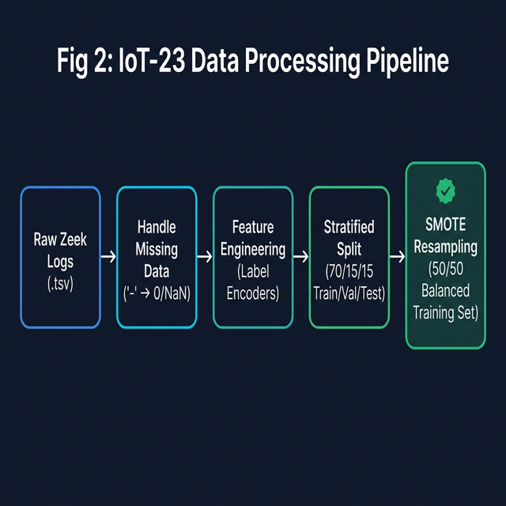

# 🧹 Data Processing: From Messy Logs to AI Fuel

> **Note to the team:** Machine Learning models are like very picky eaters. They can't eat raw data. If you feed them text or empty values, they crash. This document explains how we "cooked" the IoT-23 dataset.

## 1. The Raw Data
Our data (IoT-23) came in `.tsv` (Tab-Separated Values) format from the Zeek network monitoring tool. Imagine a massive Excel spreadsheet.

Each row is a "Connection" (a conversation between two computers).
Each column is a "Feature" (a detail about that conversation).

**Important columns include:**
*   `id.orig_h`: The IP address of the sender.
*   `proto`: The protocol (like TCP, UDP — the *rules* of the conversation).
*   `duration`: How long the conversation lasted.
*   `orig_bytes`: How much data the sender sent.
*   `label`: The answer key! Tells us if it was **Benign** (Normal) or **Malicious** (Attack).

## 2. The 10-Step ETL (Extract, Transform, Load) Pipeline
To handle the millions of rows across 23 different network captures without exhausting computer memory, we implemented a highly rigorous, reproducible 10-step Data Pipeline. *You can see this visualized live on the Data Pipeline page of the dashboard.*

1. **Discover all files recursively:** Scans the `DATA/` directory to ensure no `conn.log.labeled` capture is accidentally skipped.
2. **Pass-1 streaming scan for each capture:** Reads the massive files line-by-line (streaming) to compute block-level counts without loading full files into RAM.
3. **Build chronological block sequence:** Preserves the real-world time order of network packets before splitting them.
4. **Time split by contiguous blocks `[train][gap][val]`:** We strictly split data by time, leaving an intentional "gap" between datasets. *Why?* To reduce data leakage, preventing an attack wave that started in the training set from bleeding into the testing set.
5. **Compute available counts per split and per label:** Ensures we know exactly how many Benign and Malicious instances exist in each block before sampling.
6. **Apply per-capture size-tier caps:** The IoT-23 dataset has some captures that are giants (millions of rows) and some that are tiny. We apply a cap so the giant captures don't completely dominate the final dataset, preserving diversity.
7. **Allocate split caps (near 70/15/15):** Distributes the target row counts to roughly 70% Training, 15% Validation, and 15% Testing.
8. **Train soft balancing (binary labels):** *Crucial Step.* In real life, 99% of traffic is benign. If we train an AI on 99% benign data, it will just guess "benign" every time. We gently artificially increased the proportion of malicious samples **only in the training set** so the AI can learn the boundary. The Val/Test sets remain at their natural distribution for realistic evaluation!
9. **Pass-2 deterministic reservoir sampling:** A memory-efficient algorithm that grabs a uniform random sample of network flows using a fixed random seed (42) for perfect scientific reproducibility.
10. **Write outputs and manifests:** Saves the final `train.tsv`, `val.tsv`, and `test.tsv` files alongside a master `sampling_report.txt` audit trail.

## 3. Feature Engineering & Preprocessing
When the API receives a new flow of network traffic (or when training), we process the raw Zeek format using our `backend/data_loader.py` script:

*   **Handling Missing Values (`-`):** Zeek uses a hyphen (`-`) for nulls. We coerce all numeric columns by replacing `-` with `NaN`, and then filling `NaN` with `0`. For categorical columns (text), missing values are encoded as the explicit category `"unknown"`.
*   **Label Encoding:** AI models only understand math. We use `sklearn.preprocessing.LabelEncoder` to convert string categories (like `proto`: TCP/UDP, or `conn_state`: S0/SF) into integers. The fitted encoders are saved to `models/preprocessor.joblib`.
*   **Selected Features:** We drop useless identifiers like IP addresses and Keep 11 behavioral features: `duration`, `orig_bytes`, `resp_bytes`, `orig_pkts`, `resp_pkts`, `orig_ip_bytes`, `resp_ip_bytes`, `missed_bytes`, `proto`, `conn_state`, and `service`.

## 4. Class Imbalance Handling ⚖️

This is one of the most critical parts of our pipeline. In real-world cybersecurity data, the class distribution is **never balanced**. Our IoT-23 dataset has a ~63% Malicious / ~37% Benign split. If we trained our models on this raw data, they would be biased toward predicting "Malicious" because that's what they saw most.

We addressed this with a **multi-layered balancing strategy**. You can see this visualized on the **Data Pipeline page** of the dashboard under "Class Balancing Strategy".

### Technique 1: SMOTE (Synthetic Minority Over-sampling Technique)
*Library: `imbalanced-learn`*

**What it does:** SMOTE creates *synthetic* (fake but realistic) samples for the minority class. It works by picking a minority-class sample, finding its k-nearest neighbors (other minority samples that are "close" in feature space), and generating a new data point along the line between them.

**How we applied it:**
- SMOTE is applied **only to the training data** to prevent data leakage. The validation and test sets remain untouched so our evaluation metrics reflect real-world performance.
- Before SMOTE: 31,664 Malicious vs 18,336 Benign (63.3% / 36.7%)
- After SMOTE: 31,664 Malicious vs 31,664 Benign (50% / 50% — perfectly balanced!)
- Total training samples increased from 50,000 → 63,328

> **⚠️ Important for IEEE report:** Always mention that SMOTE was applied only to the training split. Applying it to test data is a cardinal sin in ML — it would make your evaluation metrics meaninglessly optimistic.

### Technique 2: Class Weight Balancing (Random Forest)
Random Forest uses `class_weight='balanced'`, which tells scikit-learn to automatically adjust the loss function. In plain English: getting a Benign sample wrong costs the model *more* than getting a Malicious one wrong. This mathematically compensates for any remaining imbalance.

### Technique 3: Scale Positive Weight (XGBoost)
XGBoost uses `scale_pos_weight = (negative_count / positive_count)`. This acts as a gradient multiplier during boosting, amplifying the importance of correctly predicting minority-class samples.

### Technique 4: Stratified Splitting
Our 10-step sampling pipeline preserves the original label proportions across train, validation, and test sets. This ensures each split is statistically representative of the whole dataset.

---

**Next up:** Read `03_machine_learning_models.md` to see how we trained our "brains"!
