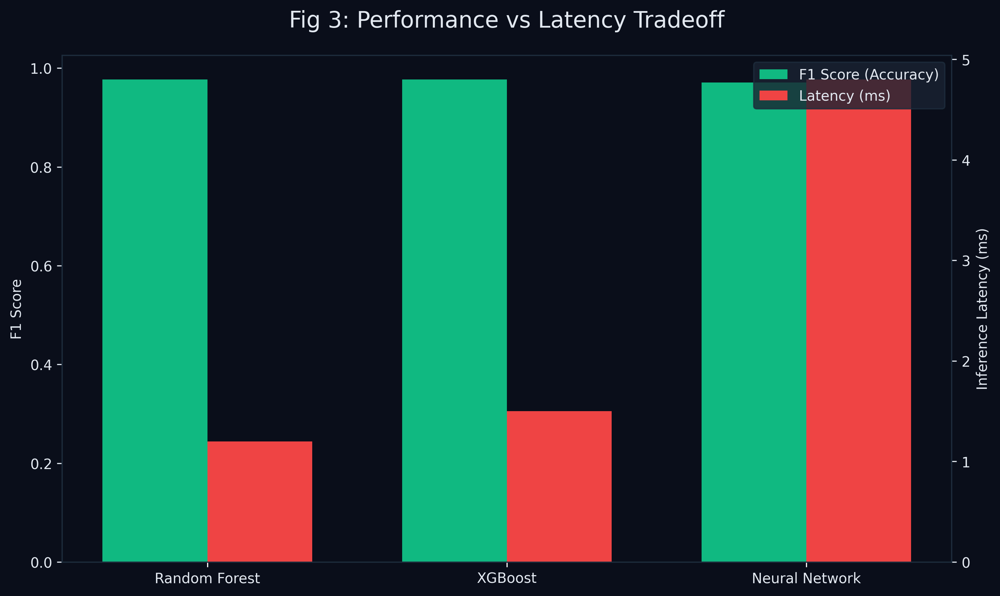

# 🧠 Machine Learning Models: The Three Brains

> **Note to the team:** This document explains the algorithms we used. You don't need to know the complex math behind them, but you *must* know how they generally work and why we picked them for the IEEE report. 

We trained three different machine learning models to classify the network traffic. We did this so we could compare their Performance (Accuracy/F1-Score) vs Latency (Speed). 

*(See `backend/train_models.py` for the exact code we used to train them).*

## 1. Random Forest (The Democratic Brain)
**How it works (Simple):** 
Imagine asking 100 randomly chosen people if an email is spam. Each person looks at different things (one looks at the sender, one looks at the spelling, one looks at the links). Then, they all vote. The majority wins.

A Random Forest is literally a forest of "Decision Trees". Each tree makes a guess using a random subset of our 11 features. They vote, and the forest outputs the final prediction (Benign or Malicious).

**Why we picked it:**
*   **Pros:** Very robust, almost never "overfits" (meaning it doesn't just memorize the answers), and it's easy to see *why* it made a decision (Explainability).
*   **Cons:** It can be slightly slow to predict because 100 trees have to vote.

## 2. XGBoost (The Perfectionist Brain)
**How it works (Simple):** 
Imagine taking a math test. You get a 70%. You look at exactly which questions you got wrong. You study *only* those topics. You take another test. You get an 85%. You repeat this until you get 100%.

XGBoost (Extreme Gradient Boosting) builds trees sequentially. Tree #2 specifically tries to fix the mistakes made by Tree #1. Tree #3 fixes the mistakes of Tree #2. 

**Why we picked it:**
*   **Pros:** Usually wins Kaggle data science competitions. It's incredibly fast and accurate.
*   **Cons:** Harder to tune than Random Forest.

## 3. Deep Neural Network (The Complex Pattern Brain)
**How it works (Simple):**
This is inspired by the human brain. We built an "MLP" (Multi-Layer Perceptron). It has layers of "neurons".
*   Layer 1 looks at the raw features.
*   Layer 2 combines them into more complex thoughts (e.g., "High duration AND UDP protocol").
*   Layer 3 combines those into the final decision.

**Why we picked it:**
*   **Pros:** Can find incredibly complex, hidden patterns in huge datasets that trees might miss.
### Technical Implementation (`backend/train_models.py`)
To ensure our code ran locally without crashing our computers, we subsampled the training data to exactly **50,000 rows**. We then trained the models incrementally at 10%, 20%, 40%, 60%, 80%, and 100% of this subsample to artificially generate the "Learning Curves" you see plotted on the dashboard.

#### 🧠 Model 1: Random Forest
*   `n_estimators: 100` (We built exactly 100 trees).
*   `max_depth: 15` (We stopped trees from growing infinitely deep to prevent overfitting).
*   `class_weight: "balanced"` (Crucial: Since benign traffic outweighs malicious heavily, this tells the mathematical loss function to penalize the model heavily if it gets a malicious packet wrong).

#### 🧠 Model 2: XGBoost
*   `n_estimators: 100`, `max_depth: 8`, `learning_rate: 0.1`
*   `scale_pos_weight: (benign_count) / (malicious_count)` (This mathematically balances the binary scale, acting as an extreme weight multiplier so the algorithm focuses intensely on catching the tiny footprint of malicious packets).

#### 🧠 Model 3: Deep Neural Network (MLPClassifier)
*   `hidden_layer_sizes: (128, 64, 32)` (We used exactly three hidden layers funneling down in size to force the network to compress its understanding).
*   `max_iter: 50` (It only loops over the data 50 times maximum).
*   `early_stopping: True`, `validation_fraction: 0.1` (We held back 10% of the training data. If the model started just "memorizing" the answers instead of actually learning, early stopping triggered and halted training instantly).

---

## 4. How did they perform?

In our tests, **Random Forest and XGBoost performed the best** with F1-scores around ~0.97 (97%). The Neural Network achieved ~0.97 as well.

> **What is an F1-Score?**
> We didn't just use "Accuracy" because it lies when data is unbalanced. (If 99% of traffic is normal, just guessing "Normal" gives 99% accuracy but catches 0 attacks).
> F1-Score balances two things:
> *   **Precision:** "When I cry wolf, is it actually a wolf?"
> *   **Recall:** "Did I catch every single wolf that exists?"

## 5. Explainable AI (XAI) with SHAP
Because Neural Networks and complex forests are "Black Boxes", we implemented **SHAP** (SHapley Additive exPlanations).

SHAP uses Game Theory to figure out exactly how much each feature contributed to the final score. 
*   If `duration = 5.0` pushed the score towards "Malicious" by 20%, SHAP records that.
*   We visualize this in the **Explainable AI page** using a waterfall chart. This proves to our professors that our AI isn't just guessing blindly!
