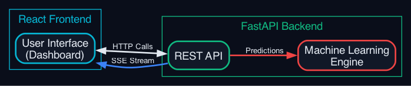
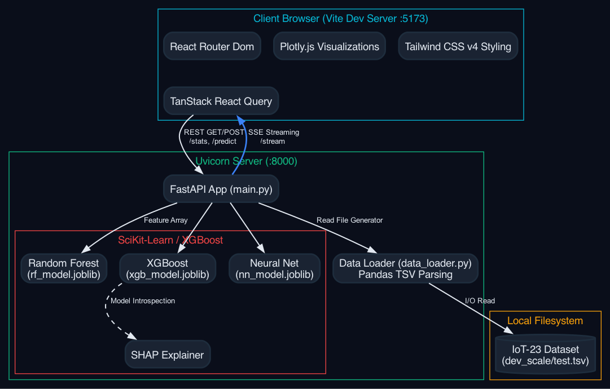

# 🏗️ System Architecture

> **Note to the team:** This explains how the actual "app" works. The backend API serving the frontend. You can literally copy-paste these mermaid diagrams into an IEEE paper visualization tool or take screenshots of them.

Our Cloud-SOC Dashboard uses a decoupled **Client-Server Architecture**.

## 1. High-Level Concept Diagram
This shows the general flow between the Client, the Server, and the Machine Learning engine.

## 2. Low-Level Component Architecture
This shows exactly how the processes, ports, classes, and filesystem interact with each other in the application.

## 2. The Backend (FastAPI / Python)
*Located in `backend/` directory.*

We built our backend using **FastAPI** because it is incredibly fast (built on ASGI) and perfect for Machine Learning applications, which naturally sit in Python environments (Scikit-learn, XGBoost, PyTorch).

**Core Endpoints:**
*   `GET /health`: Simply returns `{status: "ok"}` to tell the frontend the server is alive.
*   `GET /learning-curves`: Returns JSON lists of accuracy scores over time to plot our model performance charts.
*   `POST /predict`: Receives a JSON object (a single network flow), feeds it through our preprocessor, generates predictions from all 3 models, computes SHAP values, and returns the result.
*   `GET /stream`: This is the coolest part. We don't use standard HTTP calls here. We use **Server-Sent Events (SSE)**. The server keeps a connection open and continuously pushes new network flows from our dataset to the frontend to simulate live traffic!
*   `GET /cloud-metrics`: Generates fake AWS CloudWatch metrics (latency, CPU, Cost) with random noise to simulate a real cloud environment scaling up and down.

## 3. The Frontend (React + TypeScript + Tailwind v4)
*Located in `frontend/` directory.*

We built a modern, dark-themed dashboard using **React 18** and **Vite**.

*   **TypeScript:** Prevents bugs by strictly typing what data looks like.
*   **Tailwind CSS v4:** A utility-first CSS framework. We used it to design a custom cyber-security "dark mode" theme without writing endless CSS files.
*   **React Query:** We use this library to fetch data from the FastAPI backend. It handles caching, loading states, and automatic retries perfectly.
*   **Plotly.js:** Used to draw the complex scientific charts (Learning Curves, ROC, Confusion Matrices, and SHAP features).

## 4. Latency, Throughput, and Scalability Paradigms
As required by the course, our architecture demonstrates:
1.  **Throughput:** The `/stream` SSE endpoint controls flow sizes to mimic thousands of packets per second.
2.  **Latency Tracking:** Our `/predict` endpoint embeds a high-resolution timer (`time.perf_counter()`) to measure exactly how long model inference takes (usually single-digit milliseconds).
3.  **Scalability (Simulated):** The Cloud Infrastructure dashboard visualizes how our theoretical AWS deployment reacts to load, demonstrating knowledge of auto-scaling groups and resource provisioning.
