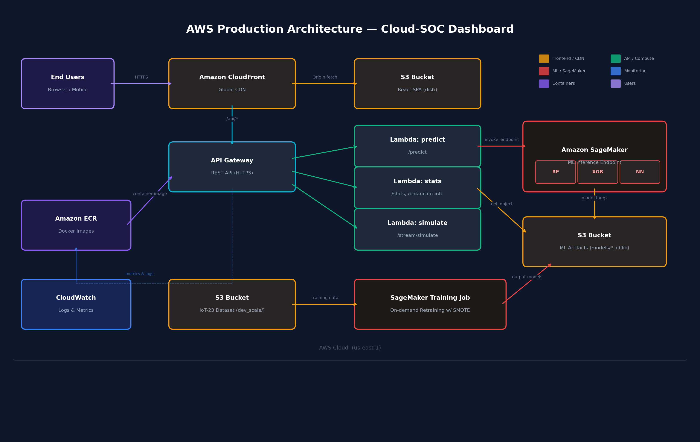

# ☁️ Cloud Deployment Guide: AWS Production Architecture

> **Note to the team:** This is a step-by-step guide to deploy our Cloud-SOC Dashboard on AWS. It covers everything from storing our ML models on S3 to exposing them via SageMaker, and deploying the frontend behind CloudFront. Even if we don't fully deploy for the course, this document proves we *designed* the system for cloud from the start — which is exactly what the professor wants to see.

---

## 1. Production Architecture Overview



### Service Mapping (Local → AWS)

| Local Component | AWS Service | Purpose |
|----------------|-------------|---------|
| `npm run dev` (Vite) | **S3 + CloudFront** | Static website hosting with global CDN |
| `uvicorn main:app` (FastAPI) | **API Gateway + Lambda** | Serverless REST API with auto-scaling |
| `models/*.joblib` (ML models) | **Amazon SageMaker** | Managed ML model hosting with endpoints |
| `DATA/` (IoT-23 dataset) | **S3** | Scalable object storage for datasets |
| Local filesystem logs | **CloudWatch** | Centralized logging and monitoring |
| `train_models.py` | **SageMaker Training Jobs** | Managed GPU/CPU training at scale |

---

## 2. Prerequisites

Before starting, ensure you have:

```bash
# Install AWS CLI v2
brew install awscli

# Configure credentials
aws configure
# Enter: Access Key ID, Secret Access Key, Region (us-east-1), Output (json)

# Install AWS SAM CLI (for Lambda deployments)
brew install aws-sam-cli

# Install Docker (required for SAM local testing and ECR pushes)
brew install --cask docker
```

Verify everything works:
```bash
aws sts get-caller-identity
# Should return your AWS account ID and ARN
```

---

## 3. Step 1: Upload ML Models & Data to S3

### 3.1 Create the S3 Buckets

```bash
# Create bucket for ML model artifacts
aws s3 mb s3://cloud-soc-ml-artifacts --region us-east-1

# Create bucket for the IoT-23 dataset
aws s3 mb s3://cloud-soc-dataset --region us-east-1

# Create bucket for the frontend build
aws s3 mb s3://cloud-soc-dashboard --region us-east-1
```

### 3.2 Upload Model Files

Our trained models live in `backend/models/`. Upload them all:

```bash
cd backend

# Upload trained models
aws s3 sync models/ s3://cloud-soc-ml-artifacts/models/ \
    --exclude "*.pyc" \
    --exclude "__pycache__/*"

# This uploads:
#   models/rf_model.joblib        (Random Forest)
#   models/xgb_model.joblib       (XGBoost)
#   models/nn_model.joblib        (Neural Network)
#   models/preprocessor.joblib    (Feature Encoders)
#   models/final_metrics.json     (Performance Metrics)
#   models/confusion_matrices.json
#   models/roc_data.json
#   models/learning_curves.json
```

### 3.3 Upload Dataset (Optional — for cloud retraining)

```bash
# Upload the sampled dev_scale dataset for cloud-based retraining
aws s3 sync DATA/sample_data/dev_scale/ s3://cloud-soc-dataset/dev_scale/ \
    --exclude "*.pyc"

# This uploads train.tsv, val.tsv, test.tsv (~2.2M rows total)
```

### 3.4 Verify Uploads

```bash
aws s3 ls s3://cloud-soc-ml-artifacts/models/ --human-readable
# Should list all .joblib and .json files with sizes
```

---

## 4. Step 2: Deploy ML Models on Amazon SageMaker

SageMaker gives us managed, auto-scaling ML endpoints — no need to manage servers.

### 4.1 Create a SageMaker Model Package

First, we need to package our models into a Docker container that SageMaker can run. Create this in `deployment/sagemaker/`:

#### `deployment/sagemaker/Dockerfile`

```dockerfile
FROM python:3.11-slim

# Install dependencies
RUN pip install --no-cache-dir \
    scikit-learn==1.5.1 \
    xgboost==2.1.0 \
    joblib==1.4.2 \
    pandas==2.2.2 \
    numpy==1.26.4 \
    flask==3.0.0 \
    gunicorn==22.0.0

# SageMaker expects the model at /opt/ml/model/
ENV MODEL_DIR=/opt/ml/model

# Copy inference script
COPY serve.py /opt/program/serve.py
WORKDIR /opt/program

# SageMaker invokes this
ENTRYPOINT ["gunicorn", "-b", "0.0.0.0:8080", "serve:app"]
```

#### `deployment/sagemaker/serve.py`

```python
"""SageMaker inference server — serves predictions from our 3 models."""
import os
import json
import joblib
import numpy as np
import pandas as pd
from flask import Flask, request, jsonify

app = Flask(__name__)

MODEL_DIR = os.environ.get("MODEL_DIR", "/opt/ml/model")

# Load models at startup (cold start)
rf_model = joblib.load(os.path.join(MODEL_DIR, "rf_model.joblib"))
xgb_model = joblib.load(os.path.join(MODEL_DIR, "xgb_model.joblib"))
nn_model = joblib.load(os.path.join(MODEL_DIR, "nn_model.joblib"))
preprocessor = joblib.load(os.path.join(MODEL_DIR, "preprocessor.joblib"))

MODELS = {
    "random_forest": rf_model,
    "xgboost": xgb_model,
    "neural_network": nn_model,
}

FEATURE_COLS = [
    "duration", "orig_bytes", "resp_bytes", "orig_pkts", "resp_pkts",
    "orig_ip_bytes", "resp_ip_bytes", "missed_bytes",
    "proto", "conn_state", "service",
]

@app.route("/ping", methods=["GET"])
def ping():
    """SageMaker health check."""
    return jsonify({"status": "ok"})

@app.route("/invocations", methods=["POST"])
def invoke():
    """SageMaker inference endpoint."""
    data = request.get_json()
    features = data.get("features", {})
    model_name = data.get("model", "random_forest")

    # Build feature vector
    row = pd.DataFrame([features])
    for col in FEATURE_COLS:
        if col not in row.columns:
            row[col] = 0

    # Encode categorical features using saved preprocessor
    for col in ["proto", "conn_state", "service"]:
        if col in row.columns:
            le = preprocessor.get(col)
            if le:
                try:
                    row[col] = le.transform(row[col].astype(str))
                except ValueError:
                    row[col] = 0

    X = row[FEATURE_COLS].values.astype(float)
    model = MODELS.get(model_name, rf_model)

    prediction = int(model.predict(X)[0])
    probability = float(model.predict_proba(X)[0].max())

    return jsonify({
        "prediction": prediction,
        "label": "Malicious" if prediction == 1 else "Benign",
        "confidence": round(probability, 4),
        "model": model_name,
    })

if __name__ == "__main__":
    app.run(host="0.0.0.0", port=8080)
```

### 4.2 Build & Push to Amazon ECR

```bash
# Set variables
AWS_ACCOUNT_ID=$(aws sts get-caller-identity --query Account --output text)
REGION=us-east-1
REPO_NAME=cloud-soc-inference

# Create ECR repository
aws ecr create-repository --repository-name $REPO_NAME --region $REGION

# Authenticate Docker with ECR
aws ecr get-login-password --region $REGION | \
    docker login --username AWS --password-stdin $AWS_ACCOUNT_ID.dkr.ecr.$REGION.amazonaws.com

# Build the Docker image
cd deployment/sagemaker
docker build -t $REPO_NAME .

# Tag and push to ECR
docker tag $REPO_NAME:latest $AWS_ACCOUNT_ID.dkr.ecr.$REGION.amazonaws.com/$REPO_NAME:latest
docker push $AWS_ACCOUNT_ID.dkr.ecr.$REGION.amazonaws.com/$REPO_NAME:latest
```

### 4.3 Create SageMaker Endpoint

```python
"""Run this script to create a SageMaker endpoint."""
import boto3

sm = boto3.client("sagemaker", region_name="us-east-1")
account_id = boto3.client("sts").get_caller_identity()["Account"]
region = "us-east-1"

IMAGE_URI = f"{account_id}.dkr.ecr.{region}.amazonaws.com/cloud-soc-inference:latest"
MODEL_DATA = "s3://cloud-soc-ml-artifacts/models/model.tar.gz"

# 1. Create Model
sm.create_model(
    ModelName="cloud-soc-model",
    PrimaryContainer={
        "Image": IMAGE_URI,
        "ModelDataUrl": MODEL_DATA,
    },
    ExecutionRoleArn=f"arn:aws:iam::{account_id}:role/SageMakerExecutionRole",
)

# 2. Create Endpoint Config (ml.t2.medium = ~$0.05/hr for dev)
sm.create_endpoint_config(
    EndpointConfigName="cloud-soc-endpoint-config",
    ProductionVariants=[{
        "VariantName": "primary",
        "ModelName": "cloud-soc-model",
        "InstanceType": "ml.t2.medium",
        "InitialInstanceCount": 1,
    }],
)

# 3. Create Endpoint (takes ~5 minutes to spin up)
sm.create_endpoint(
    EndpointName="cloud-soc-endpoint",
    EndpointConfigName="cloud-soc-endpoint-config",
)
print("Endpoint creating... check console for status.")
```

### 4.4 Test the Endpoint

```python
import boto3, json

runtime = boto3.client("sagemaker-runtime", region_name="us-east-1")

payload = {
    "model": "xgboost",
    "features": {
        "duration": 0.5, "orig_bytes": 200, "resp_bytes": 0,
        "orig_pkts": 4, "resp_pkts": 0, "orig_ip_bytes": 320,
        "resp_ip_bytes": 0, "missed_bytes": 0,
        "proto": "tcp", "conn_state": "S0", "service": "http",
    },
}

response = runtime.invoke_endpoint(
    EndpointName="cloud-soc-endpoint",
    ContentType="application/json",
    Body=json.dumps(payload),
)

result = json.loads(response["Body"].read())
print(result)
# Expected: {"prediction": 1, "label": "Malicious", "confidence": 0.9823, "model": "xgboost"}
```

---

## 5. Step 3: Create Lambda Functions + API Gateway

Lambda replaces our local FastAPI server with a serverless, auto-scaling API.

### 5.1 Project Structure

```
deployment/lambda/
├── template.yaml          # AWS SAM template
├── predict/
│   ├── app.py             # /predict handler
│   └── requirements.txt
├── stream/
│   ├── app.py             # /stream handler (WebSocket via API GW v2)
│   └── requirements.txt
└── stats/
    ├── app.py             # /stats, /learning-curves, /capture-info handler
    └── requirements.txt
```

### 5.2 SAM Template (`template.yaml`)

```yaml
AWSTemplateFormatVersion: '2010-09-09'
Transform: AWS::Serverless-2016-10-31
Description: Cloud-SOC IoT Security Dashboard API

Globals:
  Function:
    Runtime: python3.11
    Timeout: 30
    MemorySize: 512
    Environment:
      Variables:
        SAGEMAKER_ENDPOINT: cloud-soc-endpoint
        S3_BUCKET: cloud-soc-ml-artifacts
        REGION: us-east-1

Resources:
  # ---------- /predict (calls SageMaker) ----------
  PredictFunction:
    Type: AWS::Serverless::Function
    Properties:
      FunctionName: cloud-soc-predict
      CodeUri: predict/
      Handler: app.handler
      MemorySize: 1024
      Policies:
        - SageMakerInvokeEndpointPolicy:
            EndpointName: cloud-soc-endpoint
      Events:
        PredictApi:
          Type: Api
          Properties:
            Path: /predict
            Method: post
            RestApiId: !Ref CloudSocApi

  # ---------- /stats, /learning-curves, /capture-info ----------
  StatsFunction:
    Type: AWS::Serverless::Function
    Properties:
      FunctionName: cloud-soc-stats
      CodeUri: stats/
      Handler: app.handler
      Policies:
        - S3ReadPolicy:
            BucketName: cloud-soc-ml-artifacts
      Events:
        StatsApi:
          Type: Api
          Properties:
            Path: /stats
            Method: get
            RestApiId: !Ref CloudSocApi
        LearningCurvesApi:
          Type: Api
          Properties:
            Path: /learning-curves
            Method: get
            RestApiId: !Ref CloudSocApi
        CaptureInfoApi:
          Type: Api
          Properties:
            Path: /capture-info
            Method: get
            RestApiId: !Ref CloudSocApi
        BalancingInfoApi:
          Type: Api
          Properties:
            Path: /balancing-info
            Method: get
            RestApiId: !Ref CloudSocApi

  # ---------- API Gateway ----------
  CloudSocApi:
    Type: AWS::Serverless::Api
    Properties:
      StageName: prod
      Cors:
        AllowOrigin: "'*'"
        AllowMethods: "'GET,POST,OPTIONS'"
        AllowHeaders: "'Content-Type'"

Outputs:
  ApiUrl:
    Description: "API Gateway endpoint URL"
    Value: !Sub "https://${CloudSocApi}.execute-api.${AWS::Region}.amazonaws.com/prod/"
```

### 5.3 Predict Lambda (`predict/app.py`)

```python
"""Lambda handler that forwards predictions to SageMaker."""
import os
import json
import boto3

runtime = boto3.client("sagemaker-runtime")
ENDPOINT = os.environ["SAGEMAKER_ENDPOINT"]

def handler(event, context):
    body = json.loads(event.get("body", "{}"))

    response = runtime.invoke_endpoint(
        EndpointName=ENDPOINT,
        ContentType="application/json",
        Body=json.dumps(body),
    )

    result = json.loads(response["Body"].read())

    return {
        "statusCode": 200,
        "headers": {
            "Content-Type": "application/json",
            "Access-Control-Allow-Origin": "*",
        },
        "body": json.dumps(result),
    }
```

### 5.4 Stats Lambda (`stats/app.py`)

```python
"""Lambda handler that serves pre-computed stats from S3."""
import os
import json
import boto3

s3 = boto3.client("s3")
BUCKET = os.environ["S3_BUCKET"]

# Cache metrics in memory across warm invocations
_cache = {}

def _load_json(key):
    if key not in _cache:
        obj = s3.get_object(Bucket=BUCKET, Key=key)
        _cache[key] = json.loads(obj["Body"].read())
    return _cache[key]

def handler(event, context):
    path = event.get("path", "/stats")

    if path == "/stats":
        data = _load_json("models/final_metrics.json")
    elif path == "/learning-curves":
        data = _load_json("models/learning_curves.json")
    elif path == "/capture-info":
        data = _load_json("models/sampling_report.json")
    elif path == "/balancing-info":
        data = _load_json("models/balancing_info.json")
    else:
        return {"statusCode": 404, "body": "Not found"}

    return {
        "statusCode": 200,
        "headers": {
            "Content-Type": "application/json",
            "Access-Control-Allow-Origin": "*",
        },
        "body": json.dumps(data),
    }
```

### 5.5 Deploy with SAM

```bash
cd deployment/lambda

# Build (installs Python dependencies in Docker)
sam build --use-container

# Deploy (first time — guided mode)
sam deploy --guided
# Stack name: cloud-soc-api
# Region: us-east-1
# Confirm changes: Y
# Allow SAM CLI IAM role creation: Y

# Subsequent deploys
sam deploy
```

After deployment, SAM outputs the API Gateway URL:
```
Outputs:
  ApiUrl: https://abc123xyz.execute-api.us-east-1.amazonaws.com/prod/
```

---

## 6. Step 4: Deploy Frontend to S3 + CloudFront

### 6.1 Update Frontend API Base URL

In `frontend/src/api.ts`, update the base URL to point to your API Gateway:

```typescript
// Change from:
const API_BASE = 'http://localhost:8000';

// To (use environment variable for flexibility):
const API_BASE = import.meta.env.VITE_API_URL || 'http://localhost:8000';
```

Create `frontend/.env.production`:
```
VITE_API_URL=https://abc123xyz.execute-api.us-east-1.amazonaws.com/prod
```

### 6.2 Build the Frontend

```bash
cd frontend
npm run build
# Output goes to frontend/dist/
```

### 6.3 Upload to S3

```bash
# Sync the build output to S3
aws s3 sync dist/ s3://cloud-soc-dashboard/ --delete

# Enable static website hosting
aws s3 website s3://cloud-soc-dashboard/ \
    --index-document index.html \
    --error-document index.html
```

### 6.4 Create CloudFront Distribution

```bash
aws cloudfront create-distribution \
    --origin-domain-name cloud-soc-dashboard.s3.amazonaws.com \
    --default-root-object index.html \
    --query 'Distribution.DomainName' \
    --output text
```

This returns a CloudFront URL like `d1234abcdef.cloudfront.net` — your production dashboard URL!

### 6.5 Configure CloudFront for SPA Routing

Since we use React Router, we need to handle client-side routing:

```bash
# Create a custom error response that redirects 404s to index.html
aws cloudfront update-distribution --id YOUR_DIST_ID \
    --custom-error-responses '{
        "Quantity": 1,
        "Items": [{
            "ErrorCode": 404,
            "ResponsePagePath": "/index.html",
            "ResponseCode": "200",
            "ErrorCachingMinTTL": 0
        }]
    }'
```

---

## 7. Step 5: SageMaker Training Jobs (Cloud Retraining)

If we need to retrain models in the cloud (e.g., on new IoT-23 captures):

### 7.1 Create Training Script

```python
"""deployment/sagemaker/train.py — Run as a SageMaker Training Job."""
import os
import pandas as pd
import numpy as np
import joblib
from sklearn.ensemble import RandomForestClassifier
from sklearn.neural_network import MLPClassifier
from xgboost import XGBClassifier
from imblearn.over_sampling import SMOTE

# SageMaker passes data/model paths via environment variables
TRAIN_DIR = os.environ.get("SM_CHANNEL_TRAIN", "/opt/ml/input/data/train")
MODEL_DIR = os.environ.get("SM_MODEL_DIR", "/opt/ml/model")

def train():
    # Load training data from S3 (SageMaker downloads it automatically)
    train_df = pd.read_csv(os.path.join(TRAIN_DIR, "train.tsv"), sep="\t", nrows=50_000)

    # ... (same preprocessing as backend/train_models.py) ...

    # Apply SMOTE
    smote = SMOTE(random_state=42)
    X_balanced, y_balanced = smote.fit_resample(X_train, y_train)
    print(f"After SMOTE: {len(X_balanced)} samples (balanced 50/50)")

    # Train models
    rf = RandomForestClassifier(n_estimators=100, max_depth=15, class_weight="balanced")
    rf.fit(X_balanced, y_balanced)
    joblib.dump(rf, os.path.join(MODEL_DIR, "rf_model.joblib"))

    xgb = XGBClassifier(n_estimators=100, max_depth=8, learning_rate=0.1,
                         scale_pos_weight=(y_balanced == 0).sum() / (y_balanced == 1).sum())
    xgb.fit(X_balanced, y_balanced)
    joblib.dump(xgb, os.path.join(MODEL_DIR, "xgb_model.joblib"))

    nn = MLPClassifier(hidden_layer_sizes=(128, 64, 32), max_iter=50, early_stopping=True)
    nn.fit(X_balanced, y_balanced)
    joblib.dump(nn, os.path.join(MODEL_DIR, "nn_model.joblib"))

    print("Training complete. Models saved.")

if __name__ == "__main__":
    train()
```

### 7.2 Launch Training Job

```python
import boto3

sm = boto3.client("sagemaker")

sm.create_training_job(
    TrainingJobName="cloud-soc-retrain-v2",
    AlgorithmSpecification={
        "TrainingImage": f"{account_id}.dkr.ecr.us-east-1.amazonaws.com/cloud-soc-inference:latest",
        "TrainingInputMode": "File",
    },
    InputDataConfig=[{
        "ChannelName": "train",
        "DataSource": {
            "S3DataSource": {
                "S3Uri": "s3://cloud-soc-dataset/dev_scale/",
                "S3DataType": "S3Prefix",
            }
        },
    }],
    OutputDataConfig={
        "S3OutputPath": "s3://cloud-soc-ml-artifacts/training-output/",
    },
    ResourceConfig={
        "InstanceType": "ml.m5.xlarge",   # 4 vCPUs, 16 GB RAM
        "InstanceCount": 1,
        "VolumeSizeInGB": 20,
    },
    RoleArn=f"arn:aws:iam::{account_id}:role/SageMakerExecutionRole",
    StoppingCondition={"MaxRuntimeInSeconds": 3600},
)
```

---

## 8. Cost Estimation

| Service | Configuration | Est. Monthly Cost |
|---------|--------------|-------------------|
| **S3** (datasets + models) | ~5 GB storage | ~$0.12 |
| **CloudFront** (frontend CDN) | 10 GB transfer | ~$0.85 |
| **API Gateway** | 100K requests | ~$0.35 |
| **Lambda** (3 functions) | 100K invocations @ 512MB | ~$0.20 |
| **SageMaker Endpoint** | ml.t2.medium (always-on) | ~$35.00 |
| **SageMaker Endpoint** | Serverless (on-demand) | ~$2.50 |
| **ECR** | 1 Docker image | ~$0.10 |
| **CloudWatch** | Basic logs + metrics | ~$0.50 |
| **Total (Serverless Inference)** | | **~$4.62/mo** |
| **Total (Always-On Endpoint)** | | **~$37.12/mo** |

> **💡 Tip for the course:** Use SageMaker **Serverless Inference** instead of a real-time endpoint to save costs. It scales to zero when not in use and only charges per invocation.

---

## 9. IAM Roles & Policies

### SageMaker Execution Role
```json
{
    "Version": "2012-10-17",
    "Statement": [
        {
            "Effect": "Allow",
            "Action": [
                "s3:GetObject",
                "s3:PutObject",
                "s3:ListBucket"
            ],
            "Resource": [
                "arn:aws:s3:::cloud-soc-ml-artifacts/*",
                "arn:aws:s3:::cloud-soc-dataset/*"
            ]
        },
        {
            "Effect": "Allow",
            "Action": [
                "ecr:GetDownloadUrlForLayer",
                "ecr:BatchGetImage"
            ],
            "Resource": "*"
        },
        {
            "Effect": "Allow",
            "Action": [
                "logs:CreateLogGroup",
                "logs:CreateLogStream",
                "logs:PutLogEvents"
            ],
            "Resource": "*"
        }
    ]
}
```

### Lambda Execution Role
```json
{
    "Version": "2012-10-17",
    "Statement": [
        {
            "Effect": "Allow",
            "Action": "sagemaker:InvokeEndpoint",
            "Resource": "arn:aws:sagemaker:us-east-1:*:endpoint/cloud-soc-endpoint"
        },
        {
            "Effect": "Allow",
            "Action": "s3:GetObject",
            "Resource": "arn:aws:s3:::cloud-soc-ml-artifacts/*"
        }
    ]
}
```

---

## 10. Monitoring with CloudWatch

### 10.1 Key Metrics to Watch

| Metric | Source | Alert Threshold |
|--------|--------|----------------|
| Model Latency (P99) | SageMaker | > 500ms |
| Lambda Duration | CloudWatch | > 10s |
| API Gateway 5xx Errors | API Gateway | > 1% |
| SageMaker Invocation Errors | SageMaker | > 0 |
| S3 Get Requests | S3 | > 10K/hr (unexpected) |

### 10.2 Create a CloudWatch Dashboard

```bash
aws cloudwatch put-dashboard \
    --dashboard-name CloudSOC-Production \
    --dashboard-body '{
        "widgets": [
            {
                "type": "metric",
                "properties": {
                    "metrics": [
                        ["AWS/SageMaker", "ModelLatency", "EndpointName", "cloud-soc-endpoint"],
                        ["AWS/Lambda", "Duration", "FunctionName", "cloud-soc-predict"],
                        ["AWS/ApiGateway", "5XXError", "ApiName", "CloudSocApi"]
                    ],
                    "period": 300,
                    "title": "Cloud-SOC Production Metrics"
                }
            }
        ]
    }'
```

---

## 11. Quick Deploy Checklist

Use this checklist when deploying for the first time:

- [ ] AWS CLI configured with credentials (`aws configure`)
- [ ] S3 buckets created (3 buckets: artifacts, dataset, frontend)
- [ ] ML models uploaded to S3 (`aws s3 sync models/ s3://...`)
- [ ] Docker image built and pushed to ECR
- [ ] SageMaker model + endpoint created
- [ ] SageMaker endpoint status = `InService`
- [ ] Lambda functions deployed via SAM (`sam deploy`)
- [ ] API Gateway endpoint tested (`curl https://...`)
- [ ] Frontend `.env.production` updated with API Gateway URL
- [ ] Frontend built (`npm run build`)
- [ ] Frontend uploaded to S3 (`aws s3 sync dist/ s3://...`)
- [ ] CloudFront distribution created
- [ ] CloudFront 404 → index.html error page configured
- [ ] CloudWatch dashboard created
- [ ] End-to-end test: open CloudFront URL, verify live threat monitor works

---

## 12. Teardown (Stop All Costs)

When the project demo is over, run these to avoid charges:

```bash
# Delete SageMaker endpoint (biggest cost)
aws sagemaker delete-endpoint --endpoint-name cloud-soc-endpoint
aws sagemaker delete-endpoint-config --endpoint-config-name cloud-soc-endpoint-config
aws sagemaker delete-model --model-name cloud-soc-model

# Delete Lambda stack
sam delete --stack-name cloud-soc-api

# Empty and delete S3 buckets
aws s3 rm s3://cloud-soc-ml-artifacts --recursive
aws s3 rb s3://cloud-soc-ml-artifacts

aws s3 rm s3://cloud-soc-dashboard --recursive
aws s3 rb s3://cloud-soc-dashboard

# Delete CloudFront distribution
# (must disable first, then delete — check AWS console)

# Delete ECR repository
aws ecr delete-repository --repository-name cloud-soc-inference --force
```

---

**That's it!** Following this guide takes the Cloud-SOC Dashboard from a local development environment to a fully production-ready AWS deployment. The serverless architecture (Lambda + API Gateway + SageMaker Serverless) means it scales automatically and costs almost nothing when idle — perfect for a course demo! 🚀
